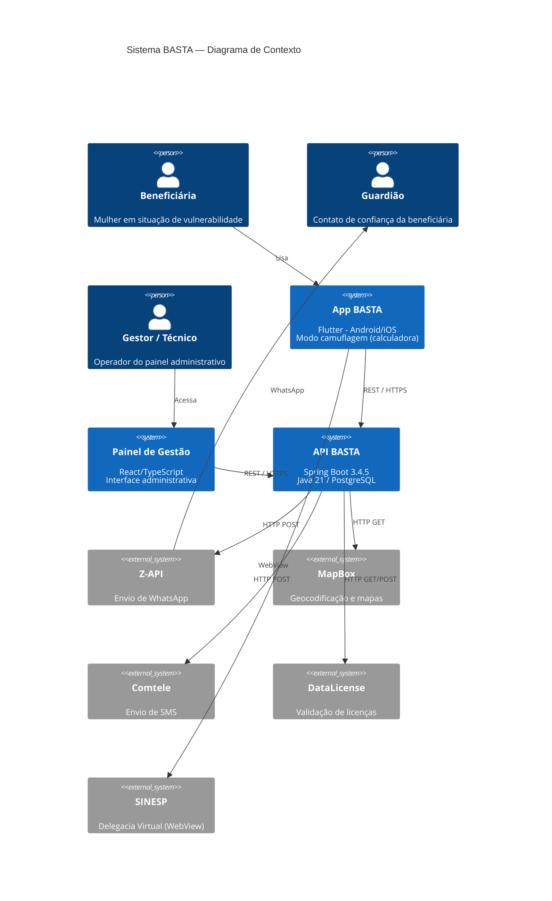
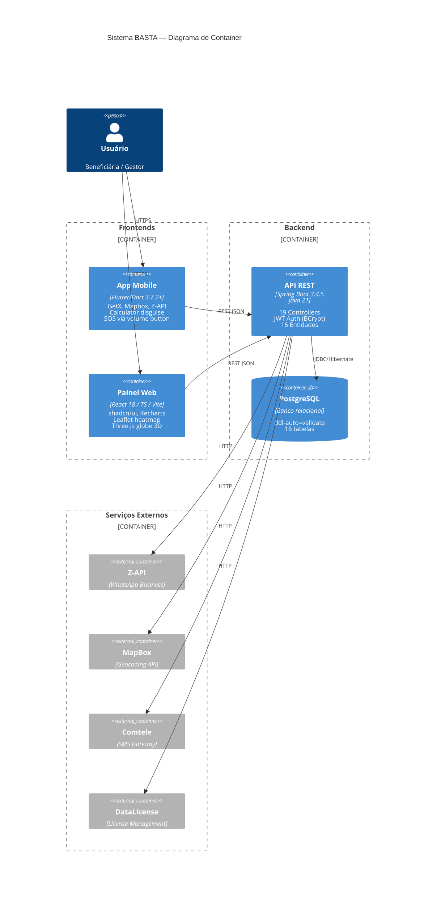
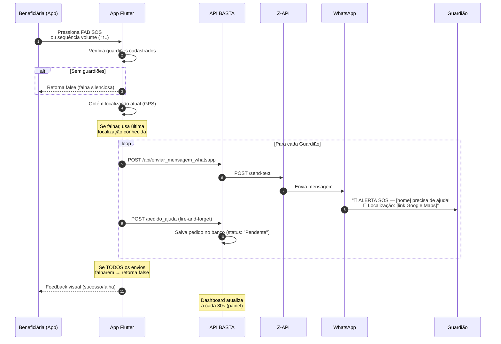
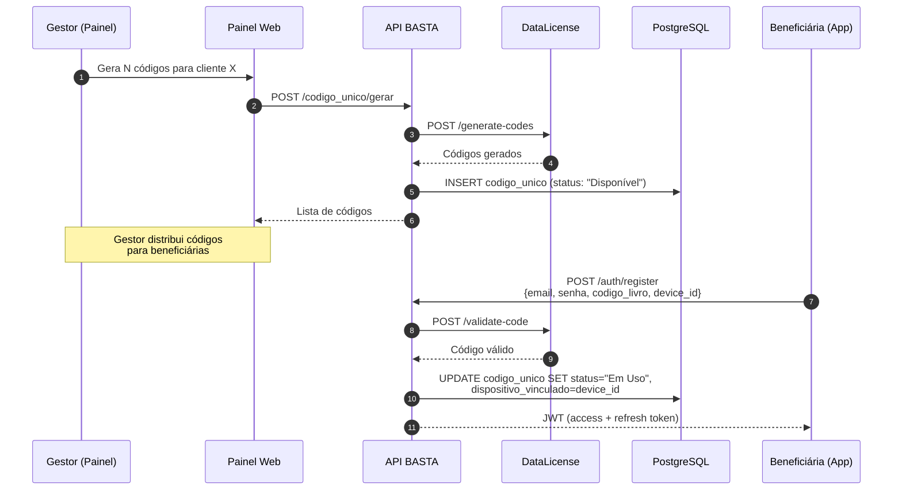
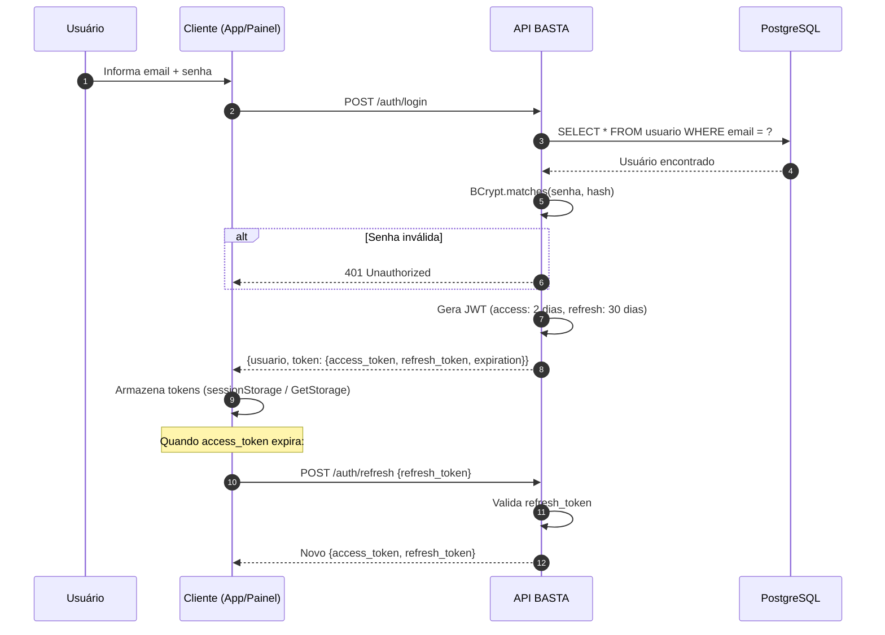
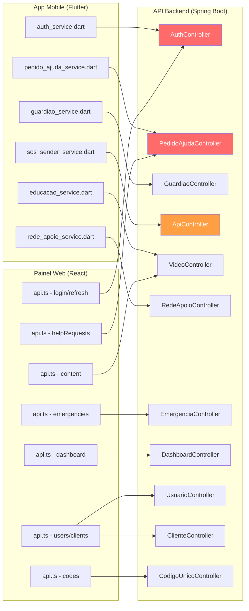

# Manual do Sistema de Gestão BASTA

## Documento para Gestores — Referência Técnica e Operacional

---

## 1. Introdução

O **Sistema BASTA** é um ecossistema completo voltado para o combate à violência contra a mulher, composto por três projetos integrados:

| Componente | Repositório | Tecnologia | Função |
|------------|------------|------------|--------|
| **API Backend** | ApiViolenciaDomestica | Spring Boot 3.4.5 / Java 21 / PostgreSQL | Lógica de negócio, persistência e integrações |
| **App Mobile** | AppViolenciaDomestica | Flutter / Dart 3.7.2+ | Aplicativo para as beneficiárias |
| **Painel de Gestão** | safe-haven-hub | React 18 / TypeScript / Vite | Interface administrativa para gestores |

O painel de gestão consome a API REST hospedada em `https://violencia-domestica-api.onrender.com`. O aplicativo mobile também consome a mesma API.

---

## 2. Arquitetura do Sistema

### 2.1. Visão Geral

```
┌─────────────────┐     ┌──────────────────────────────┐     ┌────────────────┐
│  App Mobile     │────▶│  API Backend (Spring Boot)   │◀────│  Painel Web    │
│  Flutter/Dart   │     │  Java 21 / PostgreSQL        │     │  React/TS      │
└─────────────────┘     └──────────┬───────────────────┘     └────────────────┘
                                   │
                        ┌──────────┼───────────────────┐
                        │          │                   │
                   ┌────▼────┐ ┌───▼────┐ ┌───────────▼──┐
                   │ MapBox  │ │Comtele │ │ DataLicense  │
                   │Geocoding│ │  SMS   │ │ (Licensing)  │
                   └─────────┘ └────────┘ └──────────────┘
```

### 2.2. Autenticação

- **Protocolo:** JWT (com.auth0/java-jwt)
- **Access Token:** Validade de 2 dias
- **Refresh Token:** Validade de 30 dias
- **Criptografia de senha:** BCrypt
- **Papéis:** `ROLE_USER` (app mobile) / `ROLE_ADMIN` (painel de gestão)
- **Login do painel:** `POST /auth/login-desktop`
- **Login do app:** `POST /auth/login`
- **Refresh:** `POST /auth/refresh`
- **Armazenamento (painel):** `sessionStorage` (limpo ao fechar o navegador)
- **Armazenamento (app):** `GetStorage` (persistente no dispositivo)

### 2.3. Integração com DataLicense

O sistema de licenciamento é gerido pelo serviço **DataLicense**, responsável por:
- Validar códigos de ativação
- Registrar dispositivos vinculados a códigos
- Controlar saldo de licenças por cliente
- Permitir desvinculação de dispositivos

**Fluxo:**
1. Gestor gera códigos → `POST /codigo_unico/gerar_codigos?id_cliente={id}&quantidade={qty}`
2. Usuária informa o código no app → Backend valida com DataLicense
3. Dispositivo registrado → Licença subtraída do saldo do cliente
4. Gestor pode desvincular → `PUT /codigo_unico/{id}/desvincular`

---

## 3. Telas e Funcionalidades do Painel de Gestão

### 3.1. Tela de Login

**Rota:** `/login`

**Campos:**
- **E-mail:** Endereço de e-mail cadastrado
- **Senha:** Senha de acesso (com ícone de visibilidade)

**Funcionalidades:**
- Autenticação via JWT (`POST /auth/login-desktop`)
- Troca de idioma (PT / EN / ES)
- Feedback visual durante carregamento
- Refresh automático de token ao expirar

---

### 3.2. Painel de Controle (Dashboard)

**Rota:** `/dashboard` (rota padrão após login)

**Propósito:** Visão centralizada dos indicadores do sistema com atualização automática a cada 30 segundos.

**Endpoints consumidos:**
- `GET /dashboard/totalizadores` — KPIs principais
- `GET /dashboard/emergencias_por_dia?dataInicio={}&dataFim={}` — Série temporal
- `GET /pedido-ajuda/todos` — Dados completos dos pedidos

#### Filtro de Período:
- **Hoje** — Último dia
- **Esta semana** — Últimos 7 dias
- **Este mês** — Últimos 30 dias
- **Todo período** — Todos os registros

#### Alerta de Urgência:
- Badge pulsante vermelho quando há pedidos pendentes
- Card de alerta para pedidos críticos (aguardando >3 horas)

#### Indicadores Principais (Cards Superiores):

| Indicador | Descrição |
|-----------|-----------|
| **Total de Beneficiárias** | Usuárias cadastradas no app |
| **Total de Alertas Disparados** | Todos os pedidos de ajuda registrados |
| **Chamados Hoje** | Pedidos de ajuda nas últimas 24h |
| **Posts da Comunidade** | Publicações na comunidade |
| **Guardiões Cadastrados** | Contatos de confiança registrados |

#### Status dos Pedidos de Ajuda:

| Status | Cor | Significado |
|--------|-----|-------------|
| **Pendentes** | Amarelo/Laranja | Aguardando primeiro contato |
| **Acolhidos** | Azul | Em atendimento ativo |
| **Finalizados** | Verde | Caso resolvido/encerrado |
| **Sem Interação** | Vermelho | Sem resposta da usuária |

#### Métricas de Eficiência:

| Métrica | Cor | Significado |
|---------|-----|-------------|
| **Tempo Médio de Espera** | Verde/Amarelo/Vermelho | Muda cor conforme urgência |
| **Aguardando >1h** | Laranja | Precisam de atenção |
| **Críticos >3h** | Vermelho | Requerem ação imediata |
| **Taxa de Resolução** | Azul | % de casos finalizados |

#### Visualizações Gráficas:
- **Gráfico de linha:** Tendência de chamados nos últimos 30 dias
- **Mapa de calor (Heatmap):** Densidade geográfica de ocorrências SOS (Leaflet)
- **Treemap:** Distribuição de ocorrências por cidade
- **Análise de Hotspots:** Top 5 regiões com variação mensal
- **Globo 3D:** Visualização geográfica interativa (Three.js)

#### Dados de Feedback:
- A ajuda chegou?
- Se sente segura?
- Satisfação com a rede de apoio

---

### 3.3. Pedidos de Ajuda

**Rota:** `/help-requests`

**Propósito:** Gerenciamento completo dos pedidos de socorro disparados pelas beneficiárias.

**Endpoints:**
- `GET /pedido-ajuda/todos` — Lista todos os pedidos
- `PUT /pedido-ajuda/{id}/status` — Atualizar status

**Informações exibidas:**
- Nome da usuária, telefone e e-mail
- Guardião acionado, telefone e vínculo
- Mensagem enviada (curta e completa)
- Localização (endereço + coordenadas com links Google Maps e Waze)
- Data/hora do pedido
- Tempo de espera desde o pedido
- Status atual

**Ações disponíveis:**
- Filtrar por status, período ou busca textual
- Visualizar detalhes completos em modal
- Atualizar status: Pendente → Acolhido → Finalizado / Sem Interação
- Métricas de tempo de resposta

---

### 3.4. Emergências

**Rota:** `/emergencies`

**Propósito:** Rastrear chamados de emergência (distintos dos pedidos de ajuda — representam acionamentos urgentes diretos).

**Endpoints:**
- `GET /emergencia` — Lista todas as emergências
- `PUT /emergencia/{id}` — Marcar como atendida

**Informações exibidas:**
- Nome e telefone do usuário
- Localização (latitude/longitude, endereço)
- Data/hora da emergência
- Status de atendimento
- Observações

**Ações:**
- Visualizar detalhes
- Marcar como atendida

---

### 3.5. Clientes

**Rota:** `/clients`

**Propósito:** Gerenciar organizações/empresas parceiras do BASTA.

**Endpoints:**
- `GET /cliente` — Listar todos
- `GET /cliente/{id}` — Detalhes
- `POST /cliente` — Criar
- `PUT /cliente` — Atualizar
- `DELETE /cliente/{id}` — Excluir

**Campos:**
- Nome da organização
- CNPJ (com validação de formato)
- Telefone (com validação)
- E-mail (com validação)
- Status (Ativo/Inativo)
- Quantidade de códigos contratados

**Casos de Uso:**
1. Cadastrar nova organização parceira
2. Definir cota de códigos únicos por contrato
3. Desativar/reativar cliente
4. Editar informações cadastrais

---

### 3.6. Usuários (Administradores)

**Rota:** `/users`

**Propósito:** Gerenciar usuários do painel administrativo.

**Endpoints:**
- `GET /usuario` — Listar todos
- `POST /usuario` — Criar
- `PUT /usuario` — Atualizar
- `DELETE /usuario/{id}` — Excluir

**Campos:**
- Nome
- Telefone
- E-mail
- Tipo de perfil
- Status (Ativo/Inativo)

**Tipos de Usuário:**

| Tipo | Código | Acesso |
|------|--------|--------|
| **Técnico** | T | Acesso operacional limitado |
| **Administrador** | A | Acesso administrativo completo |
| **Desenvolvedor** | D | Acesso total ao sistema |

**Ações adicionais:**
- Gerenciar guardiões vinculados a cada usuário
- Desativar/reativar contas

---

### 3.7. Códigos Únicos

**Rota:** `/codes`

**Propósito:** Gerenciar códigos de ativação vinculados a dispositivos.

**Conceito:** Cada código é associado a um aparelho. Quando um cliente adquire o serviço BASTA, recebe uma cota de códigos para ativar o app nos dispositivos das beneficiárias.

**Endpoints:**
- `GET /codigo_unico?id_cliente={id}` — Listar por cliente
- `POST /codigo_unico/gerar_codigos?id_cliente={id}&quantidade={qty}` — Gerar em lote
- `POST /codigo_unico` — Criar código individual
- `PUT /codigo_unico/{id}/associar` — Vincular a usuário/dispositivo
- `PUT /codigo_unico/{id}/desvincular` — Desvincular dispositivo
- `DELETE /codigo_unico/{id}` — Excluir (se não utilizado)

**Informações:**
- Código gerado
- Status (Disponível / Utilizado)
- Data de geração e utilização
- Cliente associado
- Usuário e dispositivo vinculado

**Fluxo de Uso:**
1. Cliente adquire pacote de códigos (cota definida no cadastro)
2. Gestor gera códigos em lote para o cliente
3. Cliente distribui códigos para as beneficiárias
4. Beneficiária informa o código no primeiro acesso do app
5. Código fica vinculado ao dispositivo (validação via DataLicense)
6. Gestor pode desvincular e liberar código para reutilização

---

### 3.8. Conteúdo

#### 3.8.1. Vídeos

**Rota:** `/videos`

**Propósito:** Gerenciar vídeos educativos exibidos no app. A tela possui **duas abas**:

**Aba 1 — Vídeos do Cliente (VideoURL):**
- Vídeos específicos de cada organização parceira
- Escopo: vinculados a um cliente e/ou município

**Endpoints:**
- `GET /video_url/cliente?id_cliente={id}` — Listar
- `POST /video_url` — Criar
- `PUT /video_url` — Atualizar
- `DELETE /video_url/{id}` — Excluir

**Aba 2 — Vídeos do App (Video):**
- Vídeos globais categorizados por tipo

**Categorias:**
| Tipo | Descrição |
|------|-----------|
| `autocuidado` | Vídeos de autocuidado e apoio emocional |
| `tipos_violencia` | Informações sobre tipos de violência |
| `leis_direitos` | Leis e direitos da mulher |
| `sinais_alerta` | Sinais de alerta de violência |

**Endpoints:**
- `GET /video?tipo={tipo}` — Listar por categoria
- `POST /video` — Criar
- `PUT /video` — Atualizar
- `DELETE /video/{id}` — Excluir

**Campos comuns:** Título, descrição, link YouTube, thumbnail (auto-gerada), cliente/município associado

#### 3.8.2. Banners

**Rota:** `/banners`

**Propósito:** Gerenciar banners promocionais/informativos exibidos na tela inicial do app.

**Endpoints:**
- `GET /banner/cliente?id_cliente={id}` — Por cliente
- `GET /banner/municipio?id_municipio={id}` — Por município
- `POST /banner` — Criar
- `PUT /banner` — Atualizar
- `DELETE /banner/{id}` — Excluir

**Campos:** Título, URL da imagem, ordem de exibição, status (ativo/inativo), cliente e município associados

#### 3.8.3. Páginas Educativas

**Rota:** `/pages`

**Propósito:** Gerenciar conteúdo textual/informativo (HTML/rich text) exibido no app.

**Endpoints:**
- `GET /pagina/cliente?id_cliente={id}` — Por cliente
- `POST /pagina` — Criar
- `PUT /pagina` — Atualizar
- `DELETE /pagina/{id}` — Excluir

**Campos:** Nome da página, conteúdo (HTML), cliente e município associados

---

### 3.9. Rede de Apoio

**Rota:** `/support-network`

**Propósito:** Gerenciar pontos de apoio exibidos no mapa do app (delegacias, centros de referência, abrigos, ONGs).

**Endpoints:**
- `GET /rede_apoio/cliente?id_cliente={id}` — Por cliente
- `GET /rede_apoio/municipio?id_municipio={id}` — Por município
- `POST /rede_apoio` — Criar
- `PUT /rede_apoio` — Atualizar
- `DELETE /rede_apoio/{id}` — Excluir

**Campos:**
- Nome do ponto de apoio
- Endereço completo
- Telefone
- Latitude e longitude (para exibição no mapa)
- Tipo (delegacia, abrigo, centro de referência, ONG)
- Descrição
- Cliente e município associados

**No app mobile:** Os pontos são exibidos em um mapa Mapbox com marcadores personalizados. A beneficiária pode tocar em um marcador para ver os detalhes e obter direções.

---

### 3.10. Telefones Úteis

**Rota:** `/helpful-phones`

**Propósito:** Gerenciar lista de telefones de emergência e apoio exibidos no app.

**Endpoints:**
- `GET /telefone_util/cliente?id_cliente={id}` — Por cliente
- `GET /telefone_util/municipio?id_municipio={id}` — Por município
- `POST /telefone_util` — Criar
- `PUT /telefone_util` — Atualizar
- `DELETE /telefone_util/{id}` — Excluir

**Exemplos:** 180 (Central de Atendimento à Mulher), 190 (Polícia Militar), CVV (Centro de Valorização da Vida), Delegacia da Mulher local

**Campos:** Nome, telefone, descrição, cliente e município associados

---

### 3.11. Comunidade

**Rota:** `/community`

**Propósito:** Moderação dos posts publicados pelas beneficiárias na comunidade do app.

**Endpoints:**
- `GET /post_comunidade?id_usuario={id}` — Listar posts
- `POST /post_comunidade` — Criar
- `PUT /post_comunidade` — Atualizar
- `DELETE /post_comunidade/{id}` — Excluir
- `GET /curtida_post_comunidade?id_post={id}` — Curtidas de um post

**Informações exibidas:**
- Título e conteúdo do post
- Autor (com opção de anonimato)
- Data da postagem
- Quantidade de curtidas
- Status de aprovação

**Ações:**
- Aprovar/rejeitar posts
- Excluir conteúdo inadequado
- Filtrar por status (aprovados, pendentes, todos)
- Visualizar engajamento (curtidas)

---

### 3.12. Dados Geográficos

**Rota:** `/geographic`

**Propósito:** Visualização e análise geográfica das ocorrências.

**Endpoints:**
- `GET /estado` — Lista de estados brasileiros
- `GET /municipio` — Lista de municípios

**Funcionalidades:**
- Seleção de estado e município para filtragem
- Visualização drill-down por região
- Mapa de calor com densidade de ocorrências (Leaflet + leaflet.heat)
- Comparação entre regiões
- Análise de tendências geográficas

---

## 4. Funcionamento do Aplicativo Mobile

### 4.1. Visão Geral

O app BASTA é desenvolvido em **Flutter** e usa **GetX** para gerência de estado. Ele se disfarça como uma calculadora para segurança da beneficiária.

**API Base:** `https://violencia-domestica-api.onrender.com`

### 4.2. Fluxo de Primeiro Acesso

1. App exibe tela de **onboarding** (3 telas de boas-vindas)
2. Beneficiária faz **cadastro** (`POST /auth/register`) informando nome, e-mail, telefone e senha
3. Informa **código único** recebido da organização parceira
4. Código validado via DataLicense → dispositivo registrado
5. Após login, pode configurar **modo camuflagem** (ícone de calculadora)

### 4.3. Telas Principais do App

| Tela | Função |
|------|--------|
| **Menu Principal** | Hub de navegação com banners e 6 seções |
| **Emergência (SOS)** | Botão central vermelho para enviar alerta |
| **Enviar Mensagem aos Guardiões** | Seleção de guardiões e envio via WhatsApp |
| **Educação** | Portal com 3 categorias de vídeos educativos |
| **Rede de Apoio** | Mapa Mapbox com pontos de apoio próximos |
| **Comunidade** | Feed de posts com curtidas |
| **Autocuidado** | Lista de vídeos verticais com player stories-style |
| **Telefones Úteis** | Números de emergência locais |
| **Guardiões** | Gerenciar contatos de confiança |
| **Delegacia Online** | WebView da Delegacia Virtual (sinesp.gov.br) |
| **Perfil** | Dados pessoais, termos de uso, configurações de segurança |

### 4.4. Recursos de Segurança

#### Modo Camuflagem (Calculadora)
- O app aparece como "Calculadora" na tela inicial do celular
- **Android:** Aliases de Activity controlam o ícone exibido (`.CalculatorIcon` ativo por padrão)
- **iOS:** Ícones alternativos via `setAlternateIcon()`
- Configurável em Perfil → Segurança

#### SOS por Botões de Volume
- **Padrão 1:** 2× Volume UP + 1× Volume DOWN (dentro de 3 segundos)
- **Padrão 2:** 2× Volume DOWN + 2× Volume UP
- Silencioso — sem feedback visual para o agressor

### 4.5. Guardiões (Contatos de Confiança)

**Endpoints:**
- `GET /guardiao?id_usuario={id}` — Listar guardiões
- `POST /guardiao` — Cadastrar guardião
- `DELETE /guardiao/{id}` — Excluir (requer senha)

**Funcionalidades:**
- Importar contato da agenda do celular
- Cadastro manual: nome, telefone, parentesco, mensagem personalizada
- Cada guardião pode ter uma mensagem customizada de SOS
- Exclusão requer confirmação com senha

### 4.6. Integrações do App

| Serviço | Uso |
|---------|-----|
| **Z-API (WhatsApp)** | Envio de mensagens SOS para guardiões via WhatsApp |
| **Mapbox** | Mapa da rede de apoio com marcadores personalizados |
| **Geolocator** | Obtenção de coordenadas GPS para emergências |
| **Google Maps / Waze** | Links de localização nas mensagens de SOS |
| **Delegacia Virtual (SINESP)** | WebView embutida para registro de ocorrência |

### 4.7. Permissões do App

| Permissão | Motivo |
|-----------|--------|
| INTERNET | Comunicação com a API |
| READ_CONTACTS / WRITE_CONTACTS | Importar guardiões da agenda |
| ACCESS_FINE_LOCATION | Localização para SOS e rede de apoio |
| FOREGROUND_SERVICE | Monitoramento de botões de volume |

---

## 5. Fluxos Principais do Sistema

### 5.1. Fluxo de SOS (Pedido de Ajuda)

```
┌──────────────────────────────────────────────────────────────────┐
│ GATILHO: Botão SOS (FAB vermelho) ou Sequência de Volume       │
└──────────────────┬───────────────────────────────────────────────┘
                   ▼
┌──────────────────────────────────────┐
│ App obtém localização atual (GPS)    │
│ via Geolocator + MapBox Geocoding   │
└──────────────────┬───────────────────┘
                   ▼
┌──────────────────────────────────────┐
│ Consulta guardiões cadastrados       │
│ GET /guardiao?id_usuario={id}        │
└──────────────────┬───────────────────┘
                   ▼
┌──────────────────────────────────────┐
│ Para cada guardião:                  │
│  • Mensagem: "Preciso da sua ajuda!" │
│  • Link Google Maps + Waze           │
│  • Envia via WhatsApp (Z-API)        │
│  • Registra: POST /pedido-ajuda      │
└──────────────────┬───────────────────┘
                   ▼
┌──────────────────────────────────────┐
│ Tela de confirmação no app           │
│ (MensagemEnviadaPage)                │
└──────────────────┬───────────────────┘
                   ▼
┌──────────────────────────────────────┐
│ PAINEL DE GESTÃO:                    │
│ Pedido aparece como "Pendente"       │
│ Badge pulsante + alerta se >3h       │
│ Equipe atende e atualiza status      │
│ Pendente → Acolhido → Finalizado    │
└──────────────────────────────────────┘
```

### 5.2. Fluxo de Licenciamento

```
┌────────────────────────────────────────────────┐
│ 1. Gestor cadastra Cliente no painel           │
│    POST /cliente (com cota de códigos)         │
└──────────────────┬─────────────────────────────┘
                   ▼
┌────────────────────────────────────────────────┐
│ 2. Gestor gera códigos em lote                 │
│    POST /codigo_unico/gerar_codigos            │
│    Backend registra no DataLicense             │
└──────────────────┬─────────────────────────────┘
                   ▼
┌────────────────────────────────────────────────┐
│ 3. Cliente distribui códigos para beneficiárias│
└──────────────────┬─────────────────────────────┘
                   ▼
┌────────────────────────────────────────────────┐
│ 4. Beneficiária ativa o app com código         │
│    Backend valida com DataLicense              │
│    Código vinculado ao dispositivo             │
│    Licença subtraída do saldo do cliente       │
└──────────────────┬─────────────────────────────┘
                   ▼
┌────────────────────────────────────────────────┐
│ 5. Gestor monitora uso no painel (rota /codes) │
│    Pode desvincular dispositivos se necessário │
└────────────────────────────────────────────────┘
```

---

## 6. API Backend — Referência de Endpoints

### 6.1. Autenticação (`/auth`)

| Método | Endpoint | Descrição |
|--------|----------|-----------|
| POST | `/auth/login` | Login do app mobile |
| POST | `/auth/login-desktop` | Login do painel de gestão |
| POST | `/auth/register` | Cadastro de nova beneficiária |
| POST | `/auth/refresh` | Renovar token JWT |
| PUT | `/auth/change_password` | Alterar senha |
| POST | `/auth/validate_password` | Validar senha atual |

### 6.2. Dashboard (`/dashboard`)

| Método | Endpoint | Descrição |
|--------|----------|-----------|
| GET | `/dashboard/totalizadores` | KPIs (usuários, emergências, posts, guardiões) |
| GET | `/dashboard/emergencias_por_dia` | Série temporal de emergências (query: dataInicio, dataFim) |

### 6.3. Pedidos de Ajuda (`/pedido-ajuda`)

| Método | Endpoint | Descrição |
|--------|----------|-----------|
| POST | `/pedido-ajuda` | Registrar novo pedido (via app) |
| GET | `/pedido-ajuda?id_usuario={id}` | Pedidos de uma beneficiária |
| GET | `/pedido-ajuda/todos` | Todos os pedidos (painel) |
| PUT | `/pedido-ajuda/{id}/status` | Atualizar status |

### 6.4. Emergências (`/emergencia`)

| Método | Endpoint | Descrição |
|--------|----------|-----------|
| POST | `/emergencia` | Registrar emergência (via app) |
| GET | `/emergencia` | Listar todas |
| PUT | `/emergencia/{id}` | Marcar como atendida |

### 6.5. Clientes (`/cliente`)

| Método | Endpoint | Descrição |
|--------|----------|-----------|
| GET | `/cliente` | Listar todos |
| GET | `/cliente/{id}` | Detalhes |
| POST | `/cliente` | Criar |
| PUT | `/cliente` | Atualizar |
| DELETE | `/cliente/{id}` | Excluir |
| GET | `/cliente/municipio?id_cliente={id}` | Por município |

### 6.6. Usuários (`/usuario`)

| Método | Endpoint | Descrição |
|--------|----------|-----------|
| GET | `/usuario` | Listar todos |
| POST | `/usuario` | Criar |
| PUT | `/usuario` | Atualizar |
| DELETE | `/usuario/{id}` | Excluir |

### 6.7. Códigos Únicos (`/codigo_unico`)

| Método | Endpoint | Descrição |
|--------|----------|-----------|
| GET | `/codigo_unico?id_cliente={id}` | Listar por cliente |
| POST | `/codigo_unico/gerar_codigos?id_cliente={id}&quantidade={qty}` | Gerar em lote |
| POST | `/codigo_unico` | Criar individual |
| PUT | `/codigo_unico/{id}/associar` | Vincular a dispositivo |
| PUT | `/codigo_unico/{id}/desvincular` | Desvincular dispositivo |
| DELETE | `/codigo_unico/{id}` | Excluir |

### 6.8. Guardiões (`/guardiao`)

| Método | Endpoint | Descrição |
|--------|----------|-----------|
| GET | `/guardiao?id_usuario={id}` | Listar por usuário |
| POST | `/guardiao` | Cadastrar |
| DELETE | `/guardiao/{id}` | Excluir |

### 6.9. Comunidade (`/post_comunidade`)

| Método | Endpoint | Descrição |
|--------|----------|-----------|
| GET | `/post_comunidade?id_usuario={id}` | Listar posts |
| POST | `/post_comunidade` | Criar post |
| PUT | `/post_comunidade` | Atualizar |
| DELETE | `/post_comunidade/{id}` | Excluir |
| POST | `/curtida_post_comunidade` | Curtir/descurtir post |
| GET | `/curtida_post_comunidade?id_post={id}` | Curtidas de um post |

### 6.10. Conteúdo

**Vídeos do App (`/video`):**

| Método | Endpoint | Descrição |
|--------|----------|-----------|
| GET | `/video?tipo={tipo}` | Listar por categoria |
| GET | `/video` | Listar todos |
| POST | `/video` | Criar |
| PUT | `/video` | Atualizar |
| DELETE | `/video/{id}` | Excluir |

**Vídeos do Cliente (`/video_url`):**

| Método | Endpoint | Descrição |
|--------|----------|-----------|
| GET | `/video_url/cliente?id_cliente={id}` | Por cliente |
| POST | `/video_url` | Criar |
| PUT | `/video_url` | Atualizar |
| DELETE | `/video_url/{id}` | Excluir |

**Banners (`/banner`):**

| Método | Endpoint | Descrição |
|--------|----------|-----------|
| GET | `/banner/cliente?id_cliente={id}` | Por cliente |
| GET | `/banner/municipio?id_municipio={id}` | Por município |
| POST | `/banner` | Criar |
| PUT | `/banner` | Atualizar |
| DELETE | `/banner/{id}` | Excluir |

**Páginas (`/pagina`):**

| Método | Endpoint | Descrição |
|--------|----------|-----------|
| GET | `/pagina/cliente?id_cliente={id}` | Por cliente |
| GET | `/pagina/municipio?id_municipio={id}&nome={nome}` | Por município e nome |
| POST | `/pagina` | Criar |
| PUT | `/pagina` | Atualizar |
| DELETE | `/pagina/{id}` | Excluir |

### 6.11. Rede de Apoio (`/rede_apoio`)

| Método | Endpoint | Descrição |
|--------|----------|-----------|
| GET | `/rede_apoio/cliente?id_cliente={id}` | Por cliente |
| GET | `/rede_apoio/municipio?id_municipio={id}` | Por município |
| POST | `/rede_apoio` | Criar |
| PUT | `/rede_apoio` | Atualizar |
| DELETE | `/rede_apoio/{id}` | Excluir |

### 6.12. Telefones Úteis (`/telefone_util`)

| Método | Endpoint | Descrição |
|--------|----------|-----------|
| GET | `/telefone_util/cliente?id_cliente={id}` | Por cliente |
| GET | `/telefone_util/municipio?id_municipio={id}` | Por município |
| POST | `/telefone_util` | Criar |
| PUT | `/telefone_util` | Atualizar |
| DELETE | `/telefone_util/{id}` | Excluir |

### 6.13. Dados Geográficos

| Método | Endpoint | Descrição |
|--------|----------|-----------|
| GET | `/estado` | Lista estados |
| GET | `/municipio` | Lista municípios |

### 6.14. Integrações Externas (`/api`)

| Método | Endpoint | Descrição |
|--------|----------|-----------|
| GET | `/api/geocode?query={endereco}` | Geocodificação via MapBox |
| POST | `/api/sms` | Envio de SMS via Comtele |

---

## 7. Modelo de Dados (Entidades)

| Entidade | Tabela | Campos Principais |
|----------|--------|-------------------|
| **Usuario** | usuario | id, nome, email, telefone, tipo (T/A/D), inativo |
| **Cliente** | cliente | id, nome, cnpj_cpf, fone, email, inativo, quant_codigos_contratados |
| **CodigoUnico** | codigo_unico | id, codigo, status, id_cliente, id_usuario_utilizacao, dispositivo_vinculado |
| **PedidoAjuda** | pedido_ajuda | id, id_usuario, nome/fone/email_usuario, nome/fone/vinculo_guardiao, mensagem, lat/long, endereco, status, data_hora |
| **Emergencia** | emergencia | id, id_usuario, nomeUsuario, telefoneUsuario, lat/long, endereco, data_hora, atendida, observacoes |
| **Guardiao** | guardiao | id, nome, telefone, parentesco/vínculo, id_usuario |
| **PostComunidade** | post_comunidade | id, titulo, conteudo, id_usuario, aprovado, data_postagem, quantidade_curtidas |
| **CurtidaPostComunidade** | curtida_post_comunidade | id, id_post_comunidade, id_usuario, data_curtida |
| **Video** | video | id, link, titulo, autor, thumbnail_url, tipo, id_cliente, inativo |
| **VideoUrl** | video_url | id, titulo, descricao, url, duracao, id_cliente, id_municipio |
| **Banner** | banner | id, titulo, imagem_url, ordem, ativo, id_cliente, id_municipio |
| **Pagina** | pagina | id, nome, conteudo, id_cliente, id_municipio |
| **RedeApoio** | rede_apoio | id, nome, endereco, telefone, lat/long, tipo, descricao, id_cliente, id_municipio |
| **TelefoneUtil** | telefone_util | id, nome, telefone, descricao, id_cliente, id_municipio |
| **Estado** | estado | id, nome, sigla |
| **Municipio** | municipio | id, nome, lat/long, codigo_ibge, estado_id |

**Banco de dados:** PostgreSQL com Hibernate (`ddl-auto=validate`)

**Relações principais:**

- `PedidoAjuda` → `Usuario` (N:1) — uma beneficiária pode ter vários pedidos
- `Emergencia` → `Usuario` (N:1) — emergências vinculadas a uma beneficiária
- `Guardiao` → `Usuario` (N:1) — cada beneficiária cadastra seus guardiões
- `CodigoUnico` → `Cliente` (N:1) — códigos pertencem a um cliente/município
- `CodigoUnico` → `Usuario` (1:1) — um código é usado por um único dispositivo
- `PostComunidade` → `Usuario` (N:1) — posts vinculados ao autor
- `CurtidaPostComunidade` → `PostComunidade` (N:1) — curtidas em posts
- `Video/Banner/Pagina/RedeApoio/TelefoneUtil` → `Cliente` + `Municipio` (multi-tenant)

---

## 8. Diagramas de Arquitetura (Mermaid)

### 8.1. Diagrama de Contexto — Visão Geral do Ecossistema



### 8.2. Diagrama de Container — Componentes Internos



### 8.3. Fluxo SOS — Diagrama de Sequência



### 8.4. Fluxo de Licenciamento — Ativação de Código



### 8.5. Fluxo de Autenticação



---

## 9. Mapa de Dependências entre Repositórios

Este mapa identifica os contratos entre os três repositórios e o impacto de mudanças na API.

### 9.1. Visão Geral de Dependências



### 9.2. Matriz de Impacto — O que Quebra se a API Mudar

| Endpoint API Alterado | Impacto no App Mobile | Impacto no Painel Web | Severidade |
|----------------------|----------------------|----------------------|------------|
| `POST /auth/login` (corpo ou resposta) | Login quebra, app inutilizado | Login quebra, painel inacessível | **CRÍTICO** |
| `POST /auth/register` (campos) | Registro impossível | N/A (painel não registra) | **CRÍTICO** |
| `POST /auth/refresh` (corpo) | Sessão expira sem renovar | Sessão expira sem renovar | **CRÍTICO** |
| `GET /pedido_ajuda/todos` (resposta) | N/A | Dashboard e lista de pedidos quebram | **ALTO** |
| `POST /pedido_ajuda` (corpo) | SOS não registra no backend | N/A | **ALTO** |
| `GET /guardiao?id_usuario=` (resposta) | Lista de guardiões vazia | N/A | **ALTO** |
| `POST /guardiao` (corpo) | Cadastro de guardiões falha | N/A | **ALTO** |
| `POST /api/enviar_mensagem_whatsapp` (corpo) | WhatsApp SOS falha | N/A | **CRÍTICO** |
| `GET /emergencia` (resposta) | N/A | Tela emergências quebra | **ALTO** |
| `GET /dashboard/*` (resposta) | N/A | Dashboard KPIs incorretos | **MÉDIO** |
| `GET /video?tipo=` (resposta) | Vídeos educativos vazio | Gerenciamento de vídeos | **MÉDIO** |
| `GET /rede_apoio/municipio?id=` (resposta) | Mapa de apoio vazio | Gerenciamento rede apoio | **MÉDIO** |
| `GET /telefone_util/municipio?id=` (resposta) | Telefones úteis vazio | Gerenciamento telefones | **BAIXO** |
| `GET /post_comunidade` (resposta) | Comunidade vazia | Moderação de posts | **BAIXO** |
| `POST /codigo_unico/gerar` (corpo) | N/A | Geração de códigos falha | **ALTO** |
| `GET /cliente` (resposta) | N/A | Painel clientes quebra | **MÉDIO** |
| `GET /usuario` (resposta) | N/A | Gerenciamento de usuários quebra | **MÉDIO** |

### 9.3. Contratos Críticos (Nunca Alterar sem Versionar)

Os seguintes contratos JSON são consumidos por **ambos** App e Painel — qualquer mudança exige versionamento:

**1. Resposta de Login (`POST /auth/login`):**
```json
{
  "usuario": {
    "idUsuario": 1,
    "nome": "string",
    "email": "string",
    "fone": "string",
    "tipo": "T|A|D",
    "inativo": false
  },
  "token": {
    "access_token": "jwt-string",
    "refresh_token": "jwt-string",
    "expiration": "ISO-datetime"
  }
}
```

**2. Corpo do Pedido de Ajuda (`POST /pedido_ajuda`):**
```json
{
  "idUsuario": 1,
  "nomeUsuario": "string",
  "foneUsuario": "string",
  "emailUsuario": "string",
  "nomeGuardiao": "string",
  "foneGuardiao": "string",
  "vinculoGuardiao": "string",
  "mensagem": "string",
  "mensagemCompleta": "string",
  "latitude": -23.5505,
  "longitude": -46.6333,
  "endereco": "string",
  "status": "Pendente"
}
```

**3. Corpo do WhatsApp SOS (`POST /api/enviar_mensagem_whatsapp`):**
```json
{
  "phone": "5511999999999",
  "message": "🚨 ALERTA SOS — Nome precisa de ajuda!\n📍 Localização: https://maps.google.com/?q=-23.55,-46.63"
}
```

### 9.4. Regras de Evolução da API

1. **Nunca remover campos** da resposta — apenas depreciar e adicionar novos
2. **Novos campos opcionais** — sempre com valor default no backend
3. **Mudanças breaking** — criar versão nova (`/v2/auth/login`) mantendo a antiga
4. **Comunicar mudanças** — notificar equipes mobile e frontend ANTES do deploy
5. **Testes cruzados** — rodar testes do app e painel contra a nova API em staging

---

## 10. Auditoria de Segurança Pré-Publicação

Auditoria realizada com base na análise direta do código-fonte dos três repositórios.

### 10.1. Vulnerabilidades Encontradas — API Backend

| # | Vulnerabilidade | Arquivo | Severidade | Descrição |
|---|----------------|---------|------------|-----------|
| 1 | **CORS Wildcard** | `CorsConfig.java` | CRÍTICO | `allowedOrigins("*")` permite requisições de qualquer site. Um site malicioso pode fazer requests autenticados se o usuário estiver logado. |
| 2 | **Token Admin Hardcoded** | `SecurityFilter.java` | CRÍTICO | Existe um mecanismo secundário de autenticação (`publicRequestsTokenCrypt`) que concede `ROLE_ADMIN` diretamente. Se a chave for comprometida, atacante vira admin. |
| 3 | **Sem Autorização por Endpoint** | `UsuarioController.java`, `PedidoAjudaController.java`, `EmergenciaController.java` | CRÍTICO | Qualquer usuário autenticado (ROLE_USER) consegue acessar `/usuario`, `/pedido_ajuda/todos`, `/emergencia` — expondo dados pessoais de TODAS as beneficiárias. |
| 4 | **Endpoint GET /auth/login** | `AuthController.java` | ALTO | Endpoint público que codifica senhas arbitrárias via BCrypt. Conflita com POST /login e deveria ser removido. |
| 5 | **Sem Validação de DTOs** | Todos os DTOs | ALTO | Nenhum DTO possui `@Valid`, `@NotNull`, `@Email`, `@Size`. Campos vazios e formatos inválidos são aceitos pela API. |
| 6 | **Senha no JSON** | `Usuario.java` | ALTO | Campo `senha` possui `@JsonProperty("senha")` em vez de `@JsonIgnore`. Embora o login service zere o campo, a model serializa por padrão. |
| 7 | **JWT Secret Default** | `application.properties` | ALTO | Default fallback é `secret` se `VIOL_DOM_SECRET_TOKEN` não estiver definido: `${VIOL_DOM_SECRET_TOKEN:secret}`. Permite forjamento de JWT. |
| 8 | **SMS Público** | `SecurityConfig.java` | ALTO | `POST /api/enviar_sms` é `permitAll()` — qualquer pessoa pode enviar SMS consumindo créditos Comtele. |
| 9 | **Change Password Público** | `SecurityConfig.java` | ALTO | `PUT /auth/change_password` é `permitAll()` sem verificação de identidade. |
| 10 | **XSS em Campos Texto** | `PedidoAjuda.java` | MÉDIO | Campos `mensagem` e `mensagemCompleta` (tipo TEXT) são armazenados sem sanitização. Se renderizados sem escaping no painel, permitem XSS. |
| 11 | **Sem Security Headers** | `SecurityConfig.java` | MÉDIO | Ausência de `X-Content-Type-Options`, `X-Frame-Options`, `Strict-Transport-Security`, `Content-Security-Policy`. |
| 12 | **Sem Rate Limiting** | Nenhum arquivo | MÉDIO | Nenhum mecanismo de limitação de taxa. Endpoints de login vulneráveis a brute force. |
| 13 | **PII em Logs** | `DataLicenseService.java` | MÉDIO | Emails de usuários registrados em logs plaintext. |
| 14 | **N+1 Queries** | Models com `@ManyToOne` | MÉDIO | `PostComunidade.usuario` usa EAGER loading por padrão. Com 1000 posts, gera 1000+ queries adicionais. |

### 10.2. Vulnerabilidades Encontradas — App Mobile

| # | Vulnerabilidade | Arquivo | Severidade | Descrição |
|---|----------------|---------|------------|-----------|
| 15 | **JWT em Plaintext** | `auth_service.dart` | CRÍTICO | Token armazenado em `GetStorage` (arquivo JSON não criptografado). Acessível via backup ou root. Deveria usar `flutter_secure_storage`. |
| 16 | **Secrets no APK** | `.env` | CRÍTICO | `API_SECRET_TOKEN`, `ZAPI_INSTANCE_TOKEN`, `MAP_BOX_TOKEN` empacotados no APK. Extraíveis com qualquer decompiler. |
| 17 | **Sem Timeout HTTP** | Todos os services | CRÍTICO | Nenhum `http.post/get` possui timeout. Servidor lento congela o app indefinidamente. |
| 18 | **SOS Falha Silenciosa** | `sos_sender_service.dart` | ALTO | Se não houver guardiões cadastrados, `return false` sem feedback ao usuário. Nenhum fallback (SMS, ligação de emergência). |
| 19 | **PII Não Apagada no Logout** | `auth_controller.dart` | ALTO | Ao deslogar, apenas `dadosLogin` é removido. Dados em cache (guardiões, localização) podem persistir. |
| 20 | **Pedido Fire-and-Forget** | `sos_sender_service.dart` | ALTO | `_pedidoAjudaService.registrar()` chamado sem `await` e sem tratamento de erro. O backend pode não registrar o SOS. |
| 21 | **Sem Cache Offline** | Todos os services | MÉDIO | Nenhum dado é cacheado localmente. Sem internet, guardiões e conteúdo educativo ficam inacessíveis. |
| 22 | **iOS HTTP Inseguro** | `Info.plist` | MÉDIO | `NSAllowsArbitraryLoads: true` permite conexões HTTP não criptografadas. |
| 23 | **Sem Certificate Pinning** | N/A | MÉDIO | Nenhuma implementação de certificate pinning. Vulnerável a MITM em redes comprometidas. |
| 24 | **Senha Calculadora em Plaintext** | `calculator_gatekeeper_page.dart` | BAIXO | Código da calculadora armazenado em `GetStorage` sem criptografia. |

### 10.3. Vulnerabilidades Encontradas — Painel Web

| # | Vulnerabilidade | Arquivo | Severidade | Descrição |
|---|----------------|---------|------------|-----------|
| 25 | **RBAC Não Implementado** | `ProtectedRoute.tsx` | CRÍTICO | `ProtectedRoute` verifica apenas `isAuthenticated`, ignora `tipo` do usuário. Técnico (T) acessa rotas de Admin (A) e Dev (D) por URL. |
| 26 | **Menus Sem Filtro por Role** | `Sidebar.tsx` | ALTO | Todos os itens do menu são visíveis para todos os usuários autenticados, independente da role. |
| 27 | **Sem Auto-Logout** | `api.ts` | ALTO | Quando token expira e refresh falha, `throw new Error('Session expired')` — usuário vê toast de erro mas NÃO é redirecionado ao login. |
| 28 | **Sem Error Boundary** | `App.tsx` | MÉDIO | Nenhum React Error Boundary. Erro de renderização mostra tela branca sem opção de recovery. |
| 29 | **Sem Request Deduplication** | `api.ts` | MÉDIO | Double-click no botão "Salvar" envia duas requisições idênticas. |
| 30 | **Visualizações Não Lazy** | `Dashboard.tsx` | MÉDIO | Three.js (183KB) e Recharts (244KB) importados eagerly. Impacta tempo de carregamento inicial. |

### 10.4. Classificação de Risco Geral

```
CRÍTICO (6 itens): #1, #2, #3, #15, #16, #25
ALTO    (10 itens): #4, #5, #6, #7, #8, #9, #18, #19, #20, #26, #27
MÉDIO   (12 itens): #10, #11, #12, #13, #14, #21, #22, #23, #28, #29, #30, #24
```

**Score de Segurança Atual: 3.5/10** — O sistema é funcional mas NÃO está pronto para produção sem correções nos itens CRÍTICOS.

---

## 11. Problemas Encontrados na Documentação v1.0

A documentação original (v1.0) do manual do gestor apresentava as seguintes deficiências, todas identificadas durante auditoria cruzada com o código-fonte:

### 11.1. Informações Incorretas

| # | Problema | Realidade |
|---|---------|-----------|
| 1 | Roles listadas como "Admin, Operador" | Sistema usa **Técnico (T), Administrador (A), Desenvolvedor (D)** |
| 2 | Idiomas listados como "PT/EN" | Sistema suporta **PT, EN e ES** (espanhol) |
| 3 | Dashboard descrito como "tabela simples" | Dashboard possui **heatmap, globo 3D, treemap, hotspots, gráficos de área** |

### 11.2. Seções Completamente Ausentes

| # | Seção Faltante | Impacto |
|---|---------------|---------|
| 4 | **Tela de Emergências** — seção inteira ausente | Gestor não sabia que existia funcionalidade separada de emergências |
| 5 | **App Mobile** — nenhuma documentação | Zero informação sobre o componente mais crítico (usado pela beneficiária) |
| 6 | **Arquitetura do Sistema** — sem visão geral | Sem entendimento de como os componentes se conectam |
| 7 | **DataLicense** — integração não mencionada | Licenciamento e ativação de códigos eram um mistério |
| 8 | **Fluxo SOS** — não documentado | Processo mais importante do sistema sem explicação |
| 9 | **Modelo de Dados** — ausente | Sem referência das entidades e relações do banco |
| 10 | **Segurança e Autenticação** — não detalhada | JWT, BCrypt, roles não explicados |

### 11.3. Seções Vazias (Stub)

| # | Seção | Estado na v1.0 |
|---|-------|---------------|
| 11 | Comunidade (2.8) | Título + "A definir" |
| 12 | Dados Geográficos (2.9) | Título sem conteúdo |
| 13 | Telefones Úteis (2.10) | Apenas título |
| 14 | Rede de Apoio (2.11) | Apenas título |

### 11.4. Funcionalidades Não Documentadas

| # | Funcionalidade | Onde Existe |
|---|---------------|------------|
| 15 | Vídeos com dual-tab (VideoURL vs Video) | Painel `/videos` |
| 16 | Modo camuflagem (calculadora) | App Mobile |
| 17 | SOS por botão de volume | App Mobile |
| 18 | Globo 3D interativo | Dashboard Painel |
| 19 | Heatmap de ocorrências | Dashboard Painel |
| 20 | Multi-tenancy por Cliente/Município | Todas as entidades |
| 21 | Auto-refresh dashboard (30s) | Dashboard Painel |
| 22 | Importação de contatos do celular | App Mobile (Guardiões) |

---

## 12. Análise de Escalabilidade e Performance

### 12.1. Gargalos Identificados

| Componente | Gargalo | Impacto | Mitigação |
|-----------|---------|---------|-----------|
| **API** | N+1 queries em `PostComunidade` e relações `@ManyToOne` EAGER | Lentidão com crescimento de dados | Adicionar `fetch=LAZY` e usar `@EntityGraph` |
| **API** | Render free tier — cold start de ~30s após inatividade | Primeiro request após inatividade é lento | Upgrade para plano pago ou usar health check keepalive |
| **API** | Sem paginação em vários endpoints (`/todos`) | Transferência de listas inteiras para o cliente | Implementar paginação (`?page=0&size=20`) |
| **Painel** | Three.js (183KB) + Recharts (244KB) carregados eagerly | Tempo de First Contentful Paint alto | React.lazy() + code splitting por rota |
| **Painel** | Filtro de busca O(n) em cada keystroke sem `useMemo` | Lentidão com listas grandes (1000+ itens) | Debounce + `useMemo` na filtragem |
| **App** | Sem cache offline — toda navegação requer request | UX degradada em redes lentas | Implementar cache local com hive/sqflite |
| **App** | Sem timeout em requests HTTP | App pode congelar indefinidamente | Adicionar `timeout: Duration(seconds: 30)` |

### 12.2. Limites de Escalabilidade Atuais

| Métrica | Limite Estimado | Razão |
|---------|----------------|-------|
| Usuários simultâneos | ~100 | Render free tier, sem connection pooling |
| Pedidos de ajuda/dia | ~500 | Z-API tem rate limit, sem fila de mensagens |
| Registros no banco | ~50.000 | Sem paginação, endpoints retornam tudo |
| SMS/dia | Depende dos créditos Comtele | Sem controle de gastos |
| Municípios ativos | ~20 | Multi-tenancy por query param, não por schema |

### 12.3. Recomendações para Escalar

1. **Connection Pooling** — Configurar HikariCP com limites adequados
2. **Paginação Universal** — `Pageable` em todos os endpoints de listagem
3. **Cache Redis** — Para dados estáticos (estados, municípios, rede de apoio)
4. **Fila de Mensagens** — RabbitMQ/SQS para SOS (garantir entrega mesmo com Z-API down)
5. **CDN para Assets** — Mover imagens de banner e thumbnails para Cloudflare/S3
6. **Horizontal Scaling** — API stateless permite múltiplas instâncias atrás de load balancer

---

## 13. Análise de UX e Acessibilidade

### 13.1. Problemas de UX — App Mobile

| # | Problema | Impacto | Recomendação |
|---|---------|---------|-------------|
| 1 | **SOS sem fallback** — Se WhatsApp falhar para todos os guardiões, nada acontece | Beneficiária em perigo sem ajuda | Adicionar fallback: SMS → chamada de emergência (190) |
| 2 | **Sem guardiões = SOS silencioso** — App retorna `false` sem explicação | Beneficiária pensa que está protegida | Exigir ao menos 1 guardião antes de habilitar SOS |
| 3 | **Padrão de volume não óbvio** — ↑↑↓ dentro de 3s | Beneficiária em pânico pode não lembrar | Tutorial interativo + opção de personalizar padrão |
| 4 | **App monolingue (PT)** — Strings hardcoded em português | Limita uso por imigrantes | Implementar i18n com `easy_localization` |
| 5 | **Erro genérico na calculadora** — Senha errada mostra resultado da conta | Usuário pode achar que esqueceu a senha | Adicionar indicador sutil (vibração leve) |

### 13.2. Problemas de UX — Painel Web

| # | Problema | Impacto | Recomendação |
|---|---------|---------|-------------|
| 6 | **Sem indicação de role** — Todas as opções visíveis para todos | Há confusão—Técnico vê opções que não deveria | Filtrar menu por role |
| 7 | **Token expirado = erro genérico** — Não redireciona ao login | Gestor vê "Erro ao carregar" sem entender | Auto-redirect para `/login` com mensagem |
| 8 | **Dashboard sem refresh manual** — Dados podem estar stale | Gestor vê dados antigos | Adicionar botão "Atualizar" + timestamp "Última atualização" |
| 9 | **Sidebar w-64 no mobile** — 256px fixos | Consome muito espaço em telas pequenas | Sidebar colapsável com hamburger menu |
| 10 | **Busca O(n) sem debounce** — Filtra a cada tecla | Lentidão perceptível com 500+ registros | `useMemo` + debounce de 300ms |

### 13.3. Problemas de Acessibilidade (WCAG 2.1)

| # | Problema | Nível WCAG | Recomendação |
|---|---------|-----------|-------------|
| 11 | Botões de ação (Editar/Excluir) são apenas ícones sem `aria-label` | A | Adicionar `aria-label="Editar usuário"` |
| 12 | Indicadores de status usam cor + texto (OK) | AA | Já adequado — manter |
| 13 | Sem skip navigation no painel | A | Adicionar link "Pular para conteúdo" |
| 14 | Sem contraste verificado nos gráficos do dashboard | AA | Testar com simulador de daltonismo |

---

## 14. Melhorias Recomendadas

### 14.1. Segurança — Prioridade CRÍTICA (Pré-Publicação)

| # | Melhoria | Arquivo Afetado | Esforço |
|---|----------|----------------|---------|
| 1 | **Restringir CORS** para domínios autorizados | `CorsConfig.java` | 30 min |
| 2 | **Remover token admin hardcoded** — usar JWT padrão com `ROLE_ADMIN` | `SecurityFilter.java` | 2h |
| 3 | **Adicionar `@PreAuthorize`** em endpoints sensíveis (usuario, pedido_ajuda/todos, emergencia) | Controllers | 3h |
| 4 | **Remover GET /auth/login** (encode de senha) | `AuthController.java` | 15 min |
| 5 | **Adicionar `@Valid` + anotações** em todos os DTOs | DTOs + Controllers | 4h |
| 6 | **Trocar `@JsonProperty` por `@JsonIgnore`** no campo senha | `Usuario.java` | 15 min |
| 7 | **Definir JWT secret obrigatório** sem fallback default | `application.properties` | 15 min |
| 8 | **Proteger endpoints públicos** (`/api/enviar_sms`, `/auth/change_password`) | `SecurityConfig.java` | 1h |
| 9 | **Usar `flutter_secure_storage`** para JWT no app | `auth_service.dart` | 3h |
| 10 | **Implementar RBAC no painel** — `RoleProtectedRoute` com verificação de `tipo` | `ProtectedRoute.tsx` + `Sidebar.tsx` | 4h |

### 14.2. Segurança — Prioridade Alta (Pós-Publicação Imediato)

| # | Melhoria | Esforço |
|---|----------|---------|
| 11 | Rate limiting nos endpoints de autenticação (Spring Cloud Gateway ou AspectJ) | 1 dia |
| 12 | Security headers (`X-Content-Type-Options`, `X-Frame-Options`, `HSTS`, `CSP`) | 2h |
| 13 | Timeout em todas as chamadas HTTP do app (30s) | 2h |
| 14 | Mover secrets do `.env` do app para backend (proxy pattern) | 1 dia |
| 15 | Auditoria de ações sensíveis (log de geração de códigos, exclusões, alterações de status) | 1 dia |
| 16 | Sanitização de campos TEXT contra XSS | 3h |
| 17 | iOS: Desabilitar `NSAllowsArbitraryLoads` | 30 min |
| 18 | Auto-logout no painel quando sessão expirar | 2h |

### 14.3. Funcionalidades — Prioridade Média

| # | Melhoria | Benefício |
|---|----------|-----------|
| 19 | **SOS fallback chain** — WhatsApp → SMS (Comtele) → ligar 190 | Proteção real em falha |
| 20 | **Notificações push** (FCM/OneSignal) no app e no painel | Tempo de resposta |
| 21 | **Dashboard auto-refresh configurável** + botão de refresh manual | Dados atualizados |
| 22 | **Exportação de relatórios** (PDF/Excel) | Prestação de contas |
| 23 | **Paginação** em todos os endpoints de listagem | Performance |
| 24 | **Cache offline no app** (guardiões, rede apoio, vídeos) | Resiliência |
| 25 | **E-mail de resumo diário** para gestores | Visibilidade |
| 26 | **Casos recorrentes** — identificar beneficiárias com múltiplos pedidos | Prevenção |
| 27 | **i18n no app** (atualmente PT-only) | Acessibilidade |
| 28 | **Error Boundary** no painel React | Estabilidade |

### 14.4. Infraestrutura — Prioridade Média

| # | Melhoria | Benefício |
|---|----------|-----------|
| 29 | **Health check endpoint** (`/actuator/health`) + monitoramento | Uptime |
| 30 | **Backup automatizado** do PostgreSQL | Disaster recovery |
| 31 | **CI/CD pipeline** (GitHub Actions) para os 3 componentes | Deploy confiável |
| 32 | **Ambiente de staging** separado de produção | Qualidade |
| 33 | **Lazy loading** do Three.js e Recharts no painel | Performance |
| 34 | **Certificate pinning** no app | Segurança MITM |
| 35 | **Connection pooling** (HikariCP) com configuração explícita | Escalabilidade |

---

## 15. Checklist de Publicação

### 15.1. Backend (API) — Estabilidade e Segurança

**Segurança:**
- [ ] CORS restrito aos domínios autorizados (painel + app) — `CorsConfig.java`
- [ ] Token admin hardcoded removido/substituído — `SecurityFilter.java`
- [ ] `@PreAuthorize("hasRole('ADMIN')")` nos endpoints sensíveis
- [ ] Endpoint `GET /auth/login` removido
- [ ] `@Valid` em todos os `@RequestBody` dos controllers
- [ ] `@JsonIgnore` no campo `senha` do `Usuario.java`
- [ ] JWT secret sem fallback default (`api.security.token.secret=${VIOL_DOM_SECRET_TOKEN}`)
- [ ] `/api/enviar_sms` e `/auth/change_password` protegidos com autenticação
- [ ] Security headers configurados (HSTS, X-Frame-Options, CSP)

**Configuração:**
- [ ] Variáveis de ambiente configuradas no Render: `VIOL_DOM_SECRET_TOKEN`, `COMTELE_AUTH_TOKEN`, `MAP_BOX_TOKEN`, credenciais DataLicense, credenciais DB
- [ ] `spring.jpa.hibernate.ddl-auto=validate` (nunca `update` ou `create`)
- [ ] Banco PostgreSQL com SSL habilitado
- [ ] HTTPS forçado em todas as rotas

**Estabilidade:**
- [ ] Rate limiting configurado para `/auth/login`, `/auth/register`
- [ ] Logs de produção configurados sem PII (remover emails dos logs do DataLicenseService)
- [ ] Health check operacional (`/actuator/health`)
- [ ] Connection pooling configurado (HikariCP)
- [ ] Testado com 50+ requisições simultâneas
- [ ] Error handler global não expõe stack traces

**Monitoramento:**
- [ ] Logs centralizados (stdout para Render)
- [ ] Alertas de erro configurados (email/Slack)
- [ ] Métricas de latência da API visíveis

### 15.2. Painel de Gestão (Frontend)

**Build e Deploy:**
- [ ] Build de produção gerado (`npm run build`) sem erros/warnings
- [ ] URL da API apontando para produção
- [ ] Code splitting por rota implementado (React.lazy)
- [ ] Bundle size analisado (< 500KB gzipped ideal)

**Funcionalidade:**
- [ ] Teste de login com credenciais reais
- [ ] RBAC implementado — Técnico não acessa rotas de Admin/Dev
- [ ] Menu do sidebar filtrado por role
- [ ] Todas as rotas protegidas (redirect para `/login`)
- [ ] Refresh de token operacional (testar sessão > 2h)
- [ ] Auto-redirect para login quando sessão expirar
- [ ] Error Boundary React implementado
- [ ] Responsividade testada (1920px, 1366px, 768px, 375px)
- [ ] Idiomas (PT/EN/ES) validados em todas as telas
- [ ] Delete com confirmação em todas as entidades

**Acessibilidade:**
- [ ] `aria-label` em botões de ícone (Editar, Excluir)
- [ ] Verificação de contraste WCAG AA
- [ ] Navegação por teclado funcional

### 15.3. App Mobile

**Build:**
- [ ] APK/AAB assinado com keystore de **produção** (não debug)
- [ ] Versão e build number atualizados (`pubspec.yaml`)
- [ ] `.env` com URLs de produção
- [ ] Build iOS com certificados válidos e provisioning profile
- [ ] `NSAllowsArbitraryLoads: false` no Info.plist

**Segurança:**
- [ ] JWT armazenado com `flutter_secure_storage` (não GetStorage)
- [ ] Secrets removidos do `.env` / migrados para backend proxy
- [ ] Timeout de 30s em todas as chamadas HTTP
- [ ] Certificate pinning implementado
- [ ] Dados limpos completamente no logout

**Funcionalidade:**
- [ ] Modo camuflagem (calculadora) funcionando Android + iOS
- [ ] SOS via FAB e via botão de volume testados
- [ ] SOS fallback implementado (WhatsApp → SMS → 190)
- [ ] Envio de WhatsApp via Z-API validado com número real
- [ ] Permissões solicitadas corretamente (contatos, localização, foreground service)
- [ ] App funcional offline (cache de guardiões e conteúdo)
- [ ] Teste com internet lenta (3G) — app não congela

### 15.4. Integrações

- [ ] Z-API — Instância ativa, créditos disponíveis, número verificado
- [ ] MapBox — Token válido, quota adequada para produção
- [ ] Comtele — Créditos de SMS suficientes para 30 dias
- [ ] DataLicense — API acessível e respondendo
- [ ] SINESP — WebView carregando corretamente (verificar URL atual)

### 15.5. Dados Iniciais

- [ ] Estados e municípios populados no banco
- [ ] Pelo menos um cliente ativo cadastrado
- [ ] Códigos de ativação gerados para testes
- [ ] Vídeos educativos (3 tipos) cadastrados
- [ ] Banners de exemplo cadastrados
- [ ] Rede de apoio com pontos reais cadastrados por município
- [ ] Telefones úteis preenchidos por município

### 15.6. Testes Pré-Deploy

- [ ] Teste end-to-end: registrar com código → login → cadastrar guardião → enviar SOS → verificar no dashboard
- [ ] Teste de stress: 20 SOS simultâneos
- [ ] Teste de sessão longa (> 2h sem re-login)
- [ ] Teste com token expirado (verificar refresh)
- [ ] Teste com API offline (verificar tratamento de erro no app e painel)

### 15.7. Monitoramento Pós-Deploy

- [ ] Verificar login no painel e no app
- [ ] Disparar SOS de teste e verificar no dashboard
- [ ] Validar recebimento de WhatsApp no guardião de teste
- [ ] Confirmar mapa de rede de apoio carregando
- [ ] Testar geração e ativação de código único
- [ ] Verificar auto-refresh do dashboard
- [ ] Confirmar que emergências aparecem no painel
- [ ] Monitorar logs por 24h para erros inesperados
- [ ] Validar tempo de resposta da API (< 2s)
- [ ] Verificar uso de memória/CPU no Render

---

## 16. Glossário

| Termo | Definição |
|-------|-----------|
| **Beneficiária** | Mulher que utiliza o app BASTA para sua proteção |
| **Guardião** | Contato de confiança cadastrado pela beneficiária para receber alertas SOS |
| **Código Único** | Chave de ativação que vincula o app a um dispositivo específico (gerenciado via DataLicense) |
| **Cliente** | Organização/empresa/município parceiro que contrata o serviço BASTA |
| **Pedido de Ajuda** | Solicitação de socorro enviada pela beneficiária (aciona guardiões via WhatsApp) |
| **Emergência** | Chamado de emergência direta registrado pelo app (distinto do pedido de ajuda) |
| **Acolhido** | Status de pedido de ajuda que está em atendimento ativo pela equipe |
| **Rede de Apoio** | Pontos físicos de apoio — delegacias, centros de referência, abrigos, ONGs |
| **Modo Camuflagem** | Recurso que faz o app aparecer como "Calculadora" para segurança da beneficiária |
| **DataLicense** | Serviço externo responsável pela validação e controle de licenças/códigos |
| **Z-API** | Serviço de envio de mensagens WhatsApp usado para alertas SOS |
| **Comtele** | Gateway de envio de SMS |
| **MapBox** | Serviço de geocodificação e renderização de mapas |
| **JWT** | JSON Web Token — padrão de autenticação usado pela API (access token 2 dias, refresh 30 dias) |
| **BCrypt** | Algoritmo de hash usado para armazenar senhas no banco de dados |
| **Multi-tenancy** | Isolamento de dados por Cliente/Município — cada entidade pertence a um cliente específico |
| **Fire-and-forget** | Padrão onde a chamada é disparada sem aguardar confirmação de sucesso |
| **RBAC** | Role-Based Access Control — controle de acesso baseado em papéis (T/A/D) |
| **CORS** | Cross-Origin Resource Sharing — política que define quais domínios podem acessar a API |
| **Rate Limiting** | Limitação do número de requisições por período para evitar abuso |

---

## 17. Contato e Suporte

Para dúvidas sobre o sistema, entre em contato com a equipe de desenvolvimento.

---

*Documento atualizado em: Março 2026*
*Versão: 3.0 — Auditoria Expandida com Diagramas, Segurança e Dependências*
*Auditado com base nos repositórios: ApiViolenciaDomestica, AppViolenciaDomestica, safe-haven-hub*
*Seções adicionadas na v3.0: Diagramas Mermaid (8), Mapa de Dependências (9), Auditoria de Segurança (10), Problemas da Documentação v1.0 (11), Escalabilidade (12), UX/Acessibilidade (13)*
